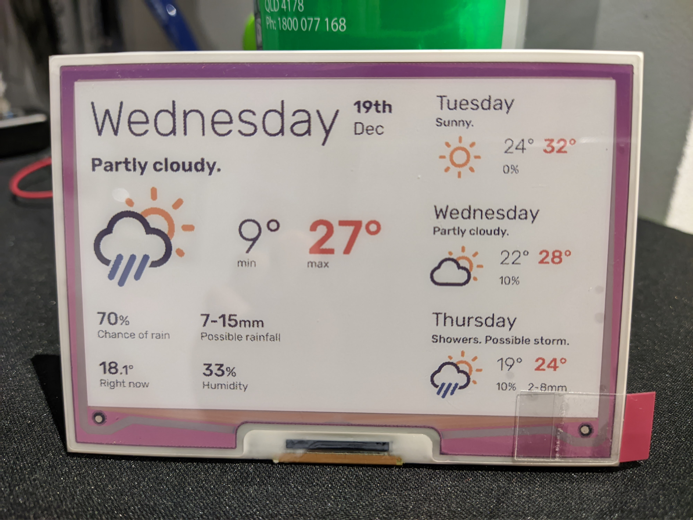

# ePaper Weather Display
A project that uses Python, Flask, Jinja and a headless Chromium process to download weather data from a reverse engineered BOM (Australian Government Bureau of Meteorology) API, render it and display it on a Pimoroni 7-colour ePaper display on a Raspberry Pi. Work in progress!

A mockup of the display:
