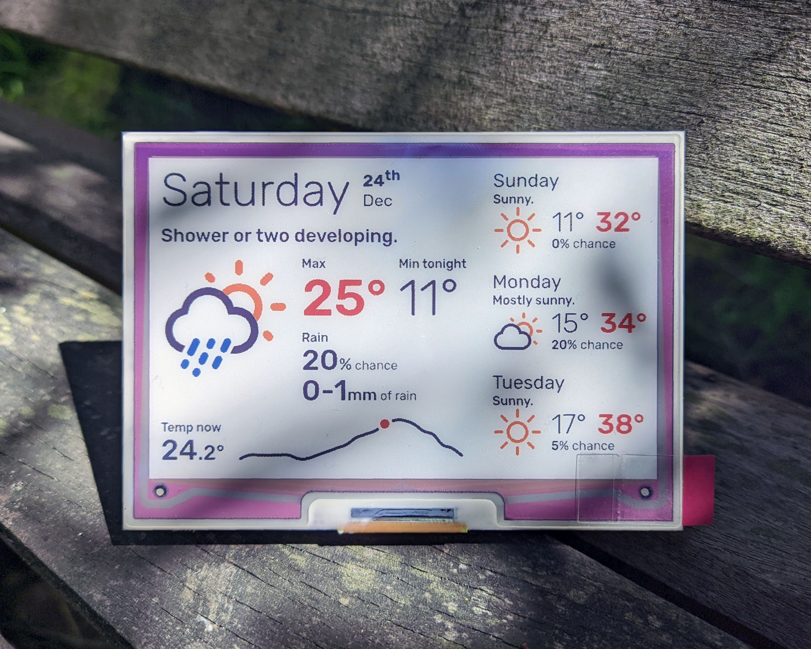

# ePaper Weather Display
**This is a work in progress. It is currently 80% functional!**

The hardware is very simple so far, a Raspberry Pi and a Pimoroni Inky Impression 4" hat. 

The software is relatively over-complicated. It is a python script that fetches weather data from a private BOM (Australian Bureau Of Meteorology) API, renders it on a web page using Flask/Jinja, and serves it to be loaded by a headless Chromium process which renders it to an image which is written to the display.

I think the method I am using to render the display using Jinja + HTML + CSS really isn't bad. It enables you to employ fancier graphics and preview the display in a web browser. However, unless you are Australian, you probably want to use a more normal API and rewrite the backend.

